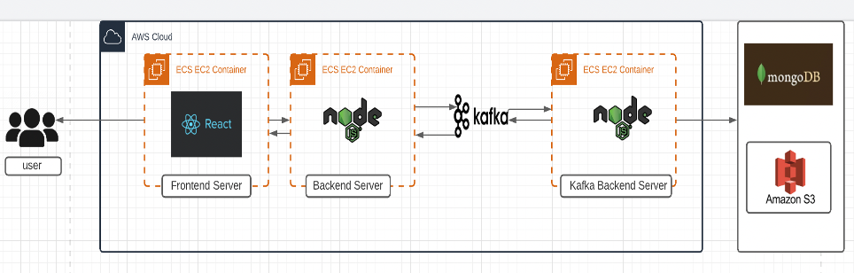

# UberEats Prototype

## Abstract

UberEats Prototype is a replica of [UberEats](https://www.ubereats.com/) web application where restaurants can conduct their business digitally and customers have a single platform to order food and perform transactions. The goal of this project is to build a reliant, scalable and fault tolerant system for smooth business operations. The application has two entities,
* **User:** A User can create their own profile, select restaurants based on preference based filters, visit the restaurant profile and add dishes to their cart, checkout and place order, and view their previous orders and receipts. 
* **Restaurant:** A restaurant can create their own profile, post content and information about their business, upload their menu, review and edit orders added by customers.

The application has the following features,
* **Backend**
    * Each backend route is secured using PassportJS to ensure no unauthorized user can access it
    * `Kafka` is used to improve performance under a large number of concurrent user requests
    * MongoDB has been used to store the data of each entity as a collection for easy retreival in a single API call on page load. 

* **Frontend**
    * The frontend heavily uses components in `ReactJS` to increase the reusability
    * Order are shown using `Pagination` so that the user does not get overwhelmed
    * Redux has been used to maintain a single data store for frontend states.

## Architecture

